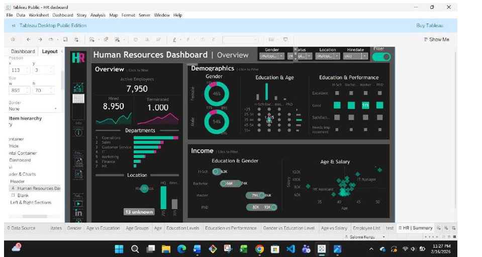
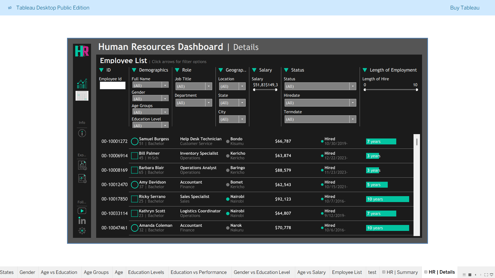
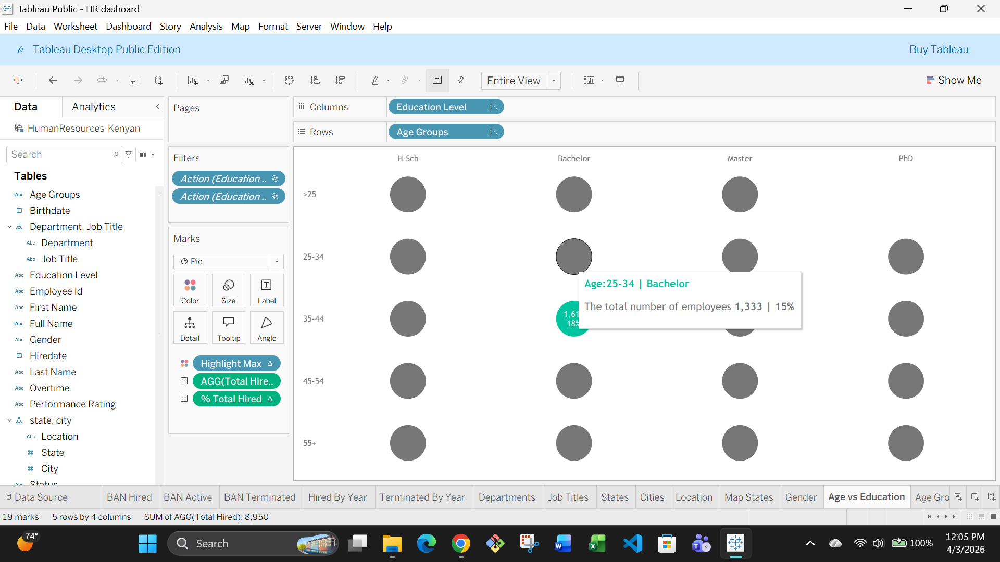
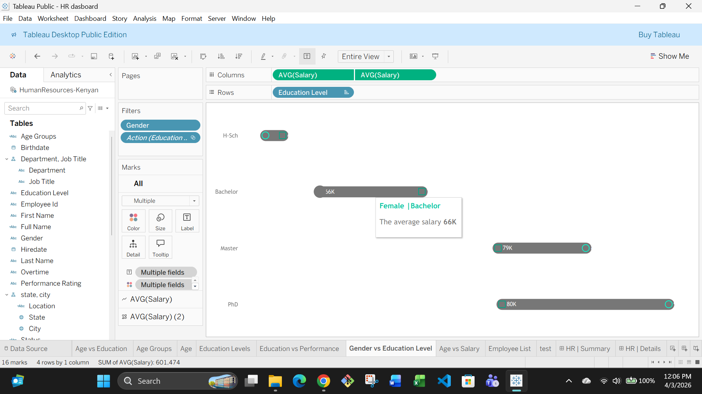
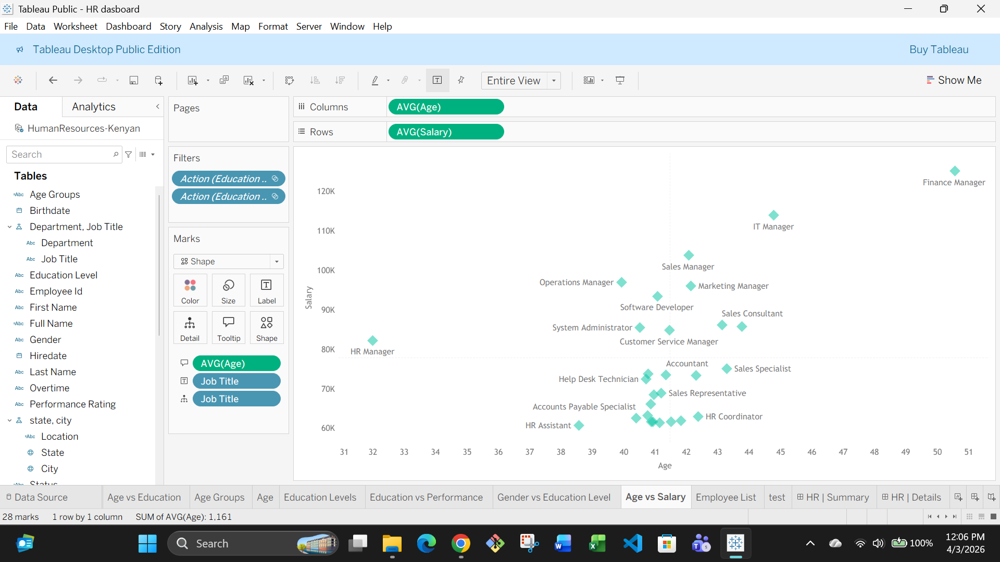

# HR Analytics Dashboard – Tableau Project
# Project Overview

This project focuses on building an interactive HR analytics dashboard using Tableau to help HR managers analyze workforce data and support data-driven decision-making.
The dashboard provides both high-level summary insights and detailed employee records, allowing users to explore employee demographics, department distribution, and salary trends. The project demonstrates practical skills in data visualization, calculated field creation, dashboard design, and cloud publishing using Tableau.

# Tools and Technologies
Tableau Desktop
Tableau Public (Cloud Publishing)
Data Visualization Techniques
Dashboard Design

# Dashboard Features
The dashboard contains three main analytical sections:
- Overview
Provides high-level HR metrics such as: Total Employees, Average Salary, Department Distribution, Workforce Summary.

- Age vs Education Analysis
Visualizes the relationship between employee age groups and education levels to understand workforce qualification distribution across different age categories.

- Gender vs Education Level
Shows the distribution of education levels across genders, helping identify patterns in academic qualifications within the organization.

- Age vs Salary
Illustrates the relationship between employee age and salary levels. This section helps identify trends such as salary growth over time, potential pay gaps, and how compensation aligns with experience or career progression.

# Tableau Public Dashboard

You can view the interactive dashboard here:

Tableau Public Link:
https://public.tableau.com/app/profile/salome.kungu/viz/HRdasboard_17712606319680/HRDetails

# Key Insights from the Dashboard

Some insights that can be derived include:
- Workforce distribution across departments
- Gender representation within the organization
- Salary variations between roles
- Education level impact on income
- Age and salary correlation patterns
